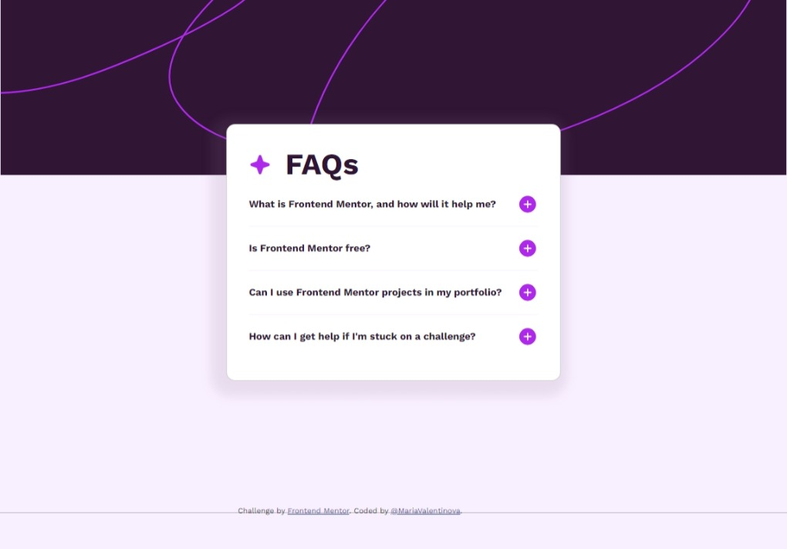
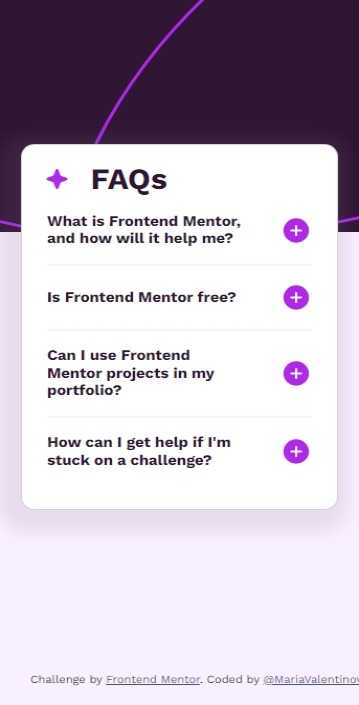
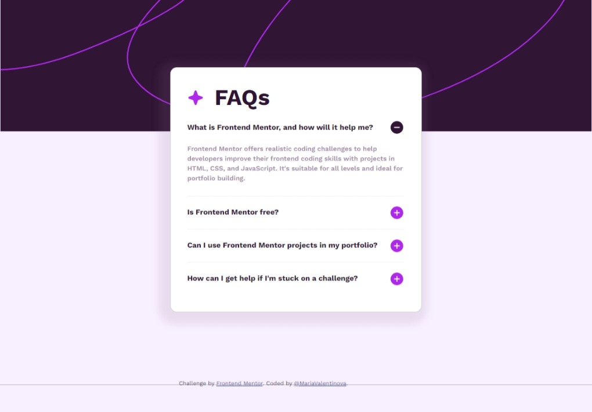

# Frontend Mentor - FAQ accordion solution

This is a solution to the [FAQ accordion challenge on Frontend Mentor](https://www.frontendmentor.io/challenges/faq-accordion-wyfFdeBwBz). Frontend Mentor challenges help you improve your coding skills by building realistic projects. 

## Table of contents

- [Overview](#overview)
  - [The challenge](#the-challenge)
  - [Screenshots](#screenshots)
- [My process](#my-process)
  - [Built with](#built-with)
  - [What I learned](#what-i-learned)
  - [Continued development](#continued-development)
- [Author](#author)

## Overview

### The challenge

Users should be able to:

-Hide/Show the answer to a question when the question is clicked
-Navigate the questions and hide/show answers using keyboard navigation alone
-View the optimal layout for the interface depending on their device's screen size
-See hover and focus states for all interactive elements on the page

### Screenshot







### Links

- Solution URL: (https://github.com/MariaValentinova/FAQ-accordion)
- Live Site URL:(https://mariavalentinova.github.io/FAQ-accordion/)

## My process

### Built with

- Semantic HTML5 markup
- CSS custom properties
- Bootstrap
- JavaScript
- Desktop-first workflow

### What I learned

I learned how to control behavior in different uses: keyboard or mouse with the help of ChatGPT. 
This project helped me reinforce my understanding of HTML, CSS, JavaScript, and responsive design principles. 

```Some Css code I'm proud of
/* Agregar outline solo cuando se usa el teclado */
.accordion-item.keyboard-focus {
    outline: 2px solid var(--Light-pink);
}

/* Eliminar el outline cuando se usa el ratón */
.using-mouse .accordion-item.keyboard-focus {
    outline: none;
}


### Continued development

I would like to improve my understanding of JavaScript functionalities.

## Author

- Frontend Mentor - [@MariaValentinova](https://www.frontendmentor.io/profile/@MariaValentinova)
